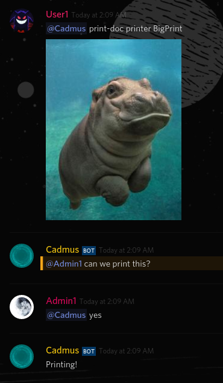

# Cadmus
Making CUPS networked printers accessable through discord. 
The print command is made for printing to a receipt printer with a max character width of 18 characters (monospace). Because of this, any text sent through the print command will be auto formatted to break on spaces (So a word under 18 does not get broken up).

The print command allows the choice of printers. This allows remote printing of documents from anywhere.

NOTE: printed files *MUST* be attached to the command message

### Documents Support
Anything the CUPS printer supports, so almost all images / word doc's / pdf's, etc

## Commands
The trigger is @botName. Ownership is determined by the userID specified in the .json.

**Open to anyone**
+ `print [any length text]`
+ `print-doc [any document/image]`
+ `get printers`
+ `get default printer`
+ `get job queue`
+ `clear job queue`
------------------------------
**Requires Owner Permission:**
+ `print-doc printer [printer name] [any document/image]`
------------------------------
**Admin Commands:**
+ `clear printer queue [printer]`
+ `set default printer [name]`
+ `yes (Must @ the bot. Allows print-doc on other printer)`

---------
## defaultsAndKeys.json should look like:

```
{
    "discord": "yeahsomthinglong.yepp.morehashshouldbehere",
    "ownerid":  "9465198416516ish",
    "default-printer": "your-printer-name-locally"
}

```

## Example
Example of user asking to print on another printer:



[pyCups Documentation](https://web.archive.org/web/20180626110936/https://pythonhosted.org/pycups/cups.Connection-class.html)
